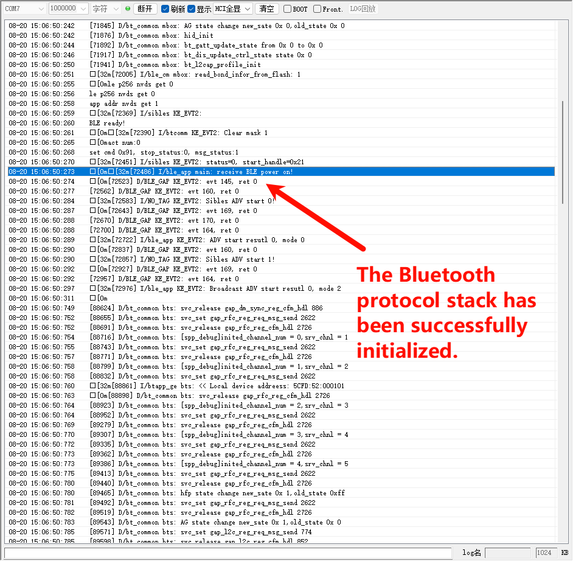
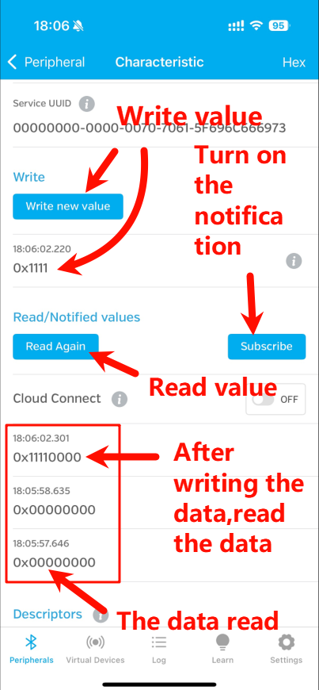

# BLE BASC例程

源码路径：example/ble/basc

## 支持的平台
例程可以运行在一下开发板上.
* sf32lb52-lcd_n16r8
* sf32lb56-lcd-a128r12n1\sf32lb56-lcd_n16r12n1
* sf32lb58-lcd-n16r64n4\sf32lb58-lcd_a128r32n1_dsi

## 概述
* 这是一个基于Sifli BLE协议栈的一个应用程序示例，可以读取到单片机的电量值，其中包含了以下功能：自定义GATT服务的创建和注册、BLE广播（用于蓝牙的连接）、数据读写和通知机制、BASC功能

## GATT协议
GATT（Generic Attribute Profile，通用属性配置文件） 是低功耗蓝牙（BLE）通信的核心规范，定义了设备间数据交互的统一框架和规则。它基于属性（Attribute） 概念组织数据，是 BLE 设备实现服务发现、数据读写、实时通知等功能的基础。GATT本质是一套数据交互协议。
GATT协议包含以下几类数据：

* 服务（Service）：相关特征的集合，代表设备的一项完整功能。
* 特征（Characteristic）：是GATT中最常见的交互单元，本质是一组相关的属性组合。例如：“心率特征” 包含 “心率值（特征值）” 和 “心率测量范围（描述符）”。
* 属性（Attribute）：是GATT中最小的数据单元。每个属性包含3部分：
    1. UUID：用于唯一标识属性。区分不同类型的数据（如 “心率值” 的 UUID 是 0x2A37，“电池电量” 是 0x2A19）
    2. 值（Value）：实际存储的数据（如心率值 “65”、电池电量 “80%”）
    3. 权限（Permissions）：属性值的访问权限，如：只读、只写、读写、通知等。
* 配置文件：是多个服务组合，针对特定应用场景定义。例如：“心率配置文件（HRP）” 规定了实现心率监测必须包含 “心率服务” 和 “电池服务”（方便用户查看设备电量）

### GATT的核心功能
发现服务与特征
* 客户端连接服务器后，首先需要 “遍历” 服务器中的服务和特征，了解对方能提供哪些数据（类似 “查询目录”）。
* 流程：客户端发送 “发现服务请求”→ 服务器返回所有服务的 UUID 和范围 → 客户端再针对每个服务发现其包含的特征。

## 例程的使用

### 例程配置前的准备
* 手机端建议：iPhone手机推荐用第三方软件LightBlue，Android端用nRF Connect进行BLE测试。
### menuconfig配置
* 默认情况下是已将需要的配置打开
```c
menuconfig --board=board_nane
```
1.使能蓝牙（Bluetooth）
- 路径：Sifli middleware → Bluetooth
    - 开启：Enable bluetooth
         - 宏开关：`CONFIG_BLUETOOTH`
         - 作用：使能蓝牙功能

2.开启蓝牙相关的finsh（BT_FLASH）
- 路径：Sifli middleware → Bluetooth → Bluetooch service  → Classic BT service
    - 开启：Enable BT finsh
         - 宏开关：`CONFIG_BT_FINSH`
         - 作用：开启蓝牙相关的Finsh shell命令支持，方便用于调试

3.用于开启蓝牙电池服务客户端（BLE battery service client）
- 路径：Sifli middleware → Bluetooth → Bluetooch service  → BLE service
    - 开启：BLE battery service client
         - 宏开关：`CONFIG_BSP_BLE_BASC`
         - 作用：用于启用蓝牙电池服务客户端(BASC)配置文件的实现，使设备能够作为客户端读取远程蓝牙设备的电池电量信息

### 编译和烧入
切换到例程project目录，运行scons命令执行编译：

```
scons --board=sf32lb52-lcd_n16r8 -j8
```

运行`build_sf32lb52-lcd_n16r8_hcpu\uart_download.bat`，按提示选择端口即可进行下载：

```
build_sf32lb52-lcd_n16r8_hcpu\uart_download.bat

Uart Download

please input the serial port num:5
```
### 运行结果展示

如果在开机log中可以看到一下log信息打印，则说明例程运行成功：
* 蓝牙协议的初始化成功

* 广播启动成功


* 在手机端打开我们上面说的下载的对应软件，并连接名为SIFLI_APP-xx-xx-xx-xx-xx-xx的蓝牙设备,如图所示


* 连接成功之后可以看到手机界面中的含有名为SIFLI_APP-xx-xx-xx-xx-xx-xx的蓝牙设备已连接，如图所示


* 可以通过手机app进行单片机电量读取，和写入数值



### 异常诊断
* 如果不能实现上面展示中的步骤，请检查手机端是否已经打开蓝牙，以及手机是否已经连接上单片机。
* 是否选择对了菜单框进入
