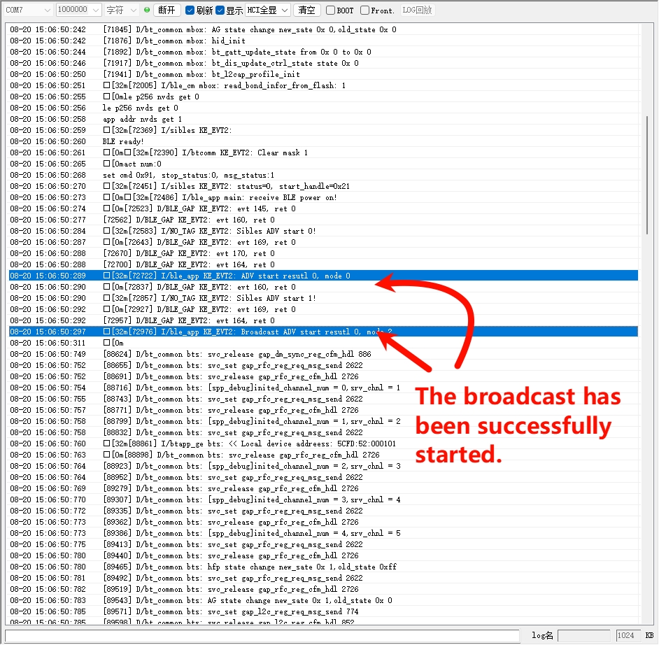
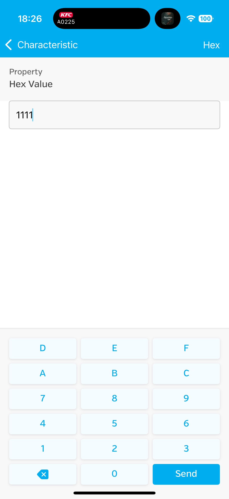

# BLE CSCPC Example

Source path: example/ble/cscpc

## Supported Platforms
The example can run on the following development boards:
* sf32lb52-lcd_n16r8
* sf32lb56-lcd_a128r12n1/sf32lb56-lcd_n16r12n1
* sf32lb58-lcd_n16r64n4/sf32lb58-lcd_a128r32n1_dsi

## Overview
* This is an application example based on the Sifli BLE protocol stack. It creates a custom GATT service, performs BLE advertising and connection, and enables basic GATT data interaction after connection. CSCPC sensor data can be sent to the mobile phone via Bluetooth, and the mobile phone can also write data.

## CSCPC Basic Concepts
* CSCPC is one of the Bluetooth standard profiles, used for receiving and processing data from cycling sensors (such as speedometers, cadence meters). This profile allows the device to connect to cycling sensors (server side) as a client and obtain relevant data.

## GATT Protocol
GATT (Generic Attribute Profile) is the core specification for low-energy Bluetooth (BLE) communication, defining a unified framework and rules for data interaction between devices. It organizes data based on the concept of attributes and is the foundation for BLE devices to implement service discovery, data read/write, real-time notifications, and other functions. GATT is essentially a data interaction protocol.
The GATT protocol includes the following types of data:

* Service: A collection of related characteristics, representing a complete function of the device.
* Characteristic: The most common interaction unit in GATT, essentially a combination of related attributes. For example: "Heart Rate Characteristic" contains "Heart Rate Value (characteristic value)" and "Heart Rate Measurement Range (descriptor)".
* Attribute: The smallest data unit in GATT. Each attribute consists of 3 parts:
    1. UUID: Uniquely identifies the attribute. Distinguishes different types of data (e.g., the UUID for "Heart Rate Value" is 0x2A37, "Battery Level" is 0x2A19)
    2. Value: The actual stored data (e.g., heart rate value "65", battery level "80%")
    3. Permissions: Access permissions for the attribute value, such as: read-only, write-only, read-write, notification, etc.
* Profile: A combination of multiple services, defined for specific application scenarios. For example: "Heart Rate Profile (HRP)" specifies that heart rate monitoring must include "Heart Rate Service" and "Battery Service" (for user convenience to check device battery level)

### Core Functions of GATT
Service and Characteristic Discovery
* After the client connects to the server, it first needs to "traverse" the services and characteristics in the server to understand what data the other party can provide (similar to "querying a directory").
* Process: Client sends "service discovery request" → Server returns all service UUIDs and ranges → Client then discovers the characteristics contained in each service.

## Example Usage

### Preparation Before Configuration
* Mobile phone recommendation: For iPhone, use third-party software LightBlue; for Android, use nRF Connect for BLE testing.

### Menuconfig Configuration
* "The required configuration is enabled by default

```c
menuconfig --board=board_name
```

1. Enable Bluetooth
- Path: Sifli middleware → Bluetooth
    - Enable: Enable bluetooth
         - Macro switch: `CONFIG_BLUETOOTH`
         - Function: Enable Bluetooth functionality

2. Enable Bluetooth-related finsh (BT_FLASH)
- Path: Sifli middleware → Bluetooth → Bluetooth service → Classic BT service
    - Enable: Enable BT finsh
         - Macro switch: `CONFIG_BT_FINSH`
         - Function: Enable Bluetooth-related Finsh shell command support for convenient debugging
         
3. Used to activate the Bluetooth cycling speed and cadence profile (Enable BLE cycling speed and cadence collector)
- Path: Sifli middleware → Bluetooth → Bluetooth service → BLE service
    - Enable: Enable BLE cycling speed and cadence collector
         - Macro switch: `CONFIG_BSP_BLE_CSCPC`
         - Function: Enable Bluetooth CSCPC profile implementation, allowing the device to act as a speed and cadence data receiver (client)

### Compilation and Flashing
Switch to the example project directory and run the scons command to compile:

```
scons --board=sf32lb52-lcd_n16r8 -j8
```

Run `build_sf32lb52-lcd_n16r8_hcpu\uart_download.bat`, and follow the prompts to select the port for downloading:

```
build_sf32lb52-lcd_n16r8_hcpu\uart_download.bat

Uart Download

please input the serial port num:5
```
### Running Result Display
If you can see log information printed in the boot log, it indicates that the example is running successfully:
* Bluetooth protocol initialization successful

* Advertising started successfully


* Open the corresponding software downloaded above on the mobile phone and connect to the Bluetooth device named SIFLI_APP-xx-xx-xx-xx-xx-xx, as shown in the figure


* After successful connection, you can see in the mobile phone interface that the Bluetooth device named SIFLI_APP-xx-xx-xx-xx-xx-xx is connected, as shown in the figure


* Data can be read and written through the mobile app




### Troubleshooting
* If you cannot achieve the steps shown above, please check if Bluetooth is turned on on the mobile phone and if the mobile phone has connected to the microcontroller.
* Check if the correct menu option has been selected